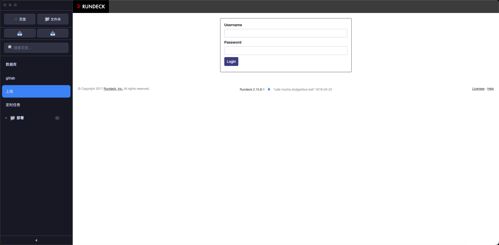

# My Task - Tab Manager / 页签管理器

> 个人浏览器页签管理工具，集中管理常用网站，安全存储登录凭据 / Personal browser tab manager with secure credential storage

[🌐 English](README_EN.md)

---

## 📝 简介 | Introduction

**中文：** My Task 是一款基于 Electron 的桌面应用，帮助你集中管理和快速访问常用网站页签，并支持安全存储网站登录凭据，实现一键自动填充。数据全部存储在本地，无需网络连接。

**English:** My Task is an Electron-based desktop app that helps you centrally manage and quickly access your frequently-used website tabs, with secure credential storage and one-click auto-fill. All data is stored locally — no internet connection required.

## ✨ 功能特点 | Features

**中文：**
- **页签管理**：快速添加、编辑、删除、搜索、拖拽排序常用网站
- **文件夹分组**：创建文件夹归类管理页签，支持展开/折叠
- **嵌入式浏览**：内置 webview 直接浏览网页，无需打开单独浏览器
- **登录凭据管理**：通过系统钥匙串加密存储，支持自动填充登录表单
- **会话保持**：跨页签共享 Cookie 和登录状态
- **数据导入导出**：支持导出/导入页签和加密凭据
- **完全离线**：所有数据存储在本地，无云端依赖

**English:**
- **Tab Management**: Quickly add, edit, delete, search, and drag-to-sort frequently-used websites
- **Folder Grouping**: Organize tabs into folders with expand/collapse support
- **Embedded Browser**: Browse websites directly via built-in webview
- **Credential Management**: Encrypted storage via system keychain, auto-fill login forms
- **Session Persistence**: Share cookies and login states across tabs
- **Import/Export**: Export and import tabs with encrypted credentials
- **Fully Offline**: All data stored locally, no cloud dependency

## 🖼️ 截图 | Screenshots



## 📦 下载 | Download

### macOS
- [Download DMG](dist/) (需自行构建: `npm run build`)
- 或克隆源码: `git clone https://github.com/dqwangyang/tab-manager.git`

## 🔧 开发 | Development

```bash
# 安装依赖
npm install

# 开发模式运行
npm run dev

# 构建 macOS 应用
npm run build
```

## 🏗️ 技术栈 | Tech Stack

- **框架**: Electron 28
- **前端**: 原生 JavaScript (ES6+)
- **样式**: CSS 自定义属性 (Catppuccin Mocha 暗色主题)
- **安全**: 上下文隔离 (contextIsolation)、系统钥匙串 (safeStorage)
- **打包**: electron-builder

## 📄 开源协议 | License

MIT License

---

## ❤️ 支持作者 | Support the Author

**中文：** 如果这个工具对你有帮助，欢迎扫码支持 ❤️

**English:** If you find this tool useful, feel free to scan the QR code to support the author ❤️


感谢你的支持！🙏
